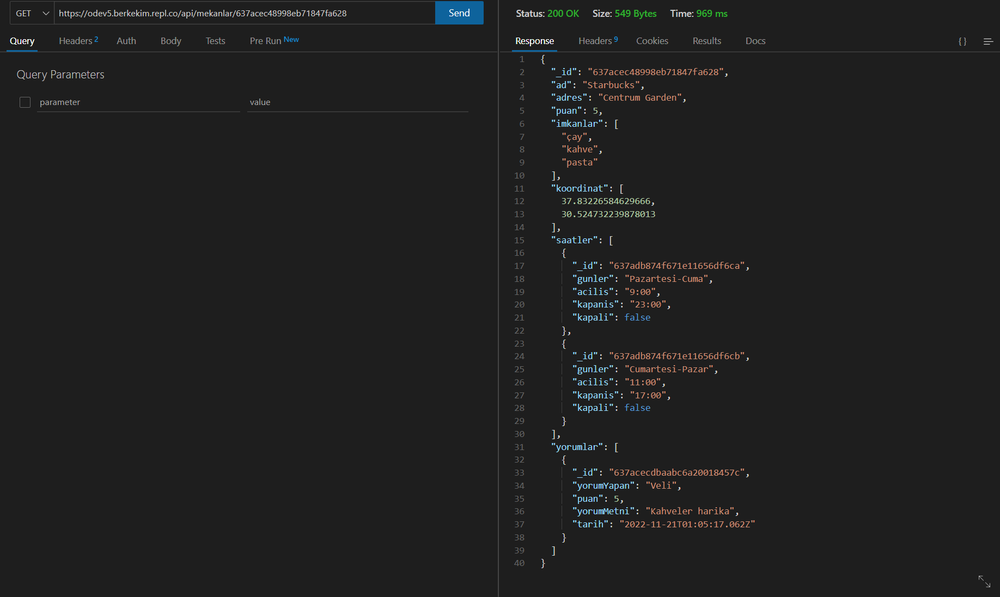
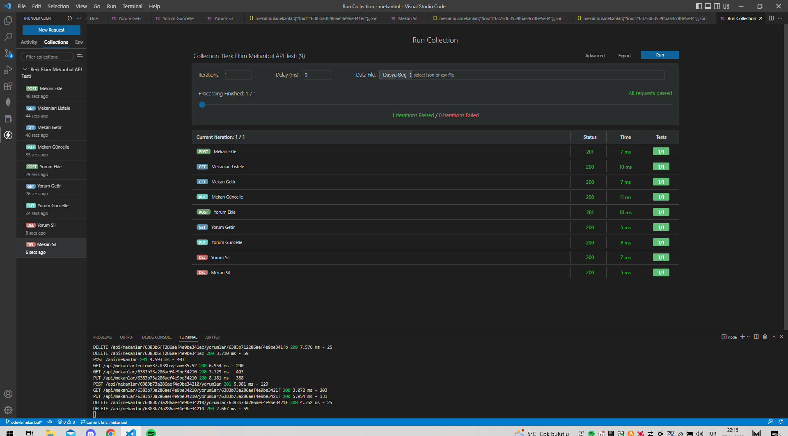
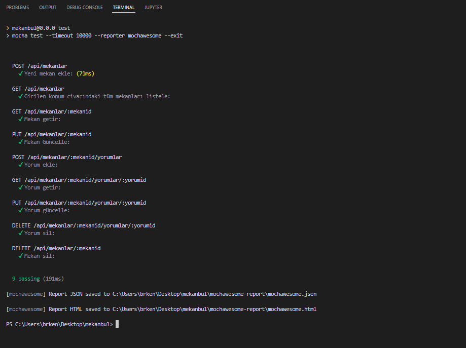

# MekanBul Rest API Adresleri
---
[1.Girilen Konum Civarındaki Mekanları Listele](https://odev5.berkekim.repl.co/api/mekanlar?enlem=37.7&boylam=35.4)

[2.Mekan ID ile Mekan Bilgilerini Getir](https://odev5.berkekim.repl.co/api/mekanlar/637acec48998eb71847fa628)

[3.Bir Mekana Ait Belirli Bir Yorumu Getir](https://odev5.berkekim.repl.co/api/mekanlar/637acec48998eb71847fa628/yorumlar/637acecdbaabc6a20018457c)

# MekanBul Rest API Test Sonucu
---

